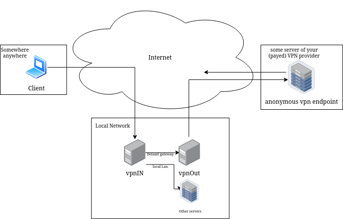
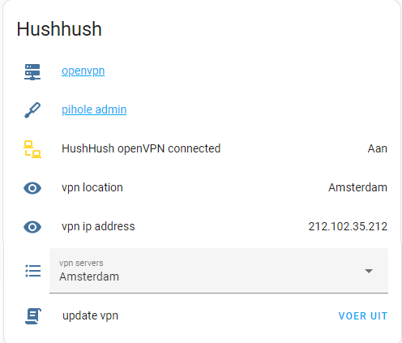

# Secure VPN With Local Lan

On the internet a VPN can mean two things.
You had purchased some VPN subscription to use where ever to make a direct secure connection to an Internet Entry point where on the globe. 
OR you have a vpn to your home/work location enable your local network on your roaming device.
This is Both.

This git describes and utilizes a VPN Connection to a home network with a secure VPN Connection to the internet. 

Somewhere -> VPN -> Localnetwork -> VPN -> Some anonymous gateway.


I wrrote a very rudimental but working web interface to select diffrent VPN Gateway Connections


Better use Home assistant to get information.



two Machines are uses to create this setup. VpnGateway and incomingVpnServer.

The routing inteligence is the following Iptable/IP rule:
```
iptables -A FORWARD -i tun0 -j ACCEPT 
iptables -t nat -A POSTROUTING -o eth0 -j MASQUERADE 
ip route add 10.8.0.0/24 dev tun0 table 11
ip route add default via VpnGateway dev eth0 table 11
ip rule add from 10.8.0.0/24 table 11
ip rule add to 10.8.0.0/24 table 11
```

# Setup VpnGateway
for this you require an VPN hosting using openvpn
1) place working not asking for password openvpn configurations in the folder /etc/openvpn/clientConfig
```
auth-user-pass /etc/openvpn/password.txt
```
2) install the vpnadmin.sh to /usr/bin/local and grant it passwordless sudo for the www-data user
3) copy /etc/rsyslog.d/openvpn.conf
4) install a webserver
5) copy the php site. !change the hardcoded username/password
6) systemctl enable openvpn@client.conf

now vpnadmin should work. 


# Setup incomingVpnServer
1) install a openvpn server. (or wireguard) I recommend use a script like https://www.pivpn.io/
2) copy the up.sh script to /etc/openvpn/
3) edit the up script you your local ip settings
4) apply
```
script-security 3 
up /etc/openvpn/up.sh
```
to the server.conf
