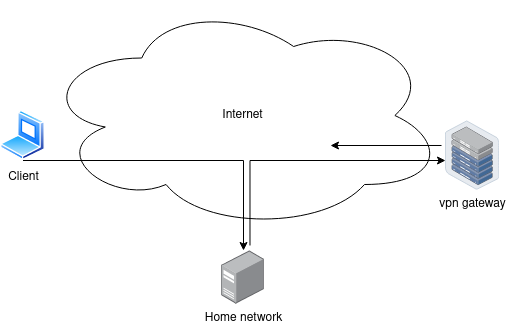

# Secure VPN With Local Lan
This git is for users who want a VPN Connection to their home network. With a secure VPN Connection to the internet. 

Somewhere -> VPN -> Localnetwork -> VPN -> Some anonymous gateway.


I wrote a very rudimental but working web interface to select diffrent VPN Gateway Connections


two Machines are uses to create this setup. VpnGateway and incomingVpnServer.

The routing inteligence is the following Iptable/IP rule:
```
iptables -A FORWARD -i tun0 -j ACCEPT 
iptables -t nat -A POSTROUTING -o eth0 -j MASQUERADE 
ip route add 10.8.0.0/24 dev tun0 table 11
ip route add default via VpnGateway dev eth0 table 11
ip rule add from 10.8.0.0/24 table 11
ip rule add to 10.8.0.0/24 table 11
```

# Setup VpnGateway
for this you require an VPN hosting using openvpn
1) place working openvpn configurations in /etc/openvpn/clientConfig 
2) install the vpnadmin.sh to /usr/bin/local and grant it passwordless sudo for the www-data user
3) copy /etc/rsyslog.d/openvpn.conf
4) copy the php site.


# Setup incomingVpnServer
1) install a openvpn server. I recommend use a script like https://www.pivpn.io/

2) copy the up.sh script to /etc/openvpn/
3) edit the up script you your local ip settings
4) apply
```
script-security 3 
up /etc/openvpn/up.sh
```
to the server.conf
